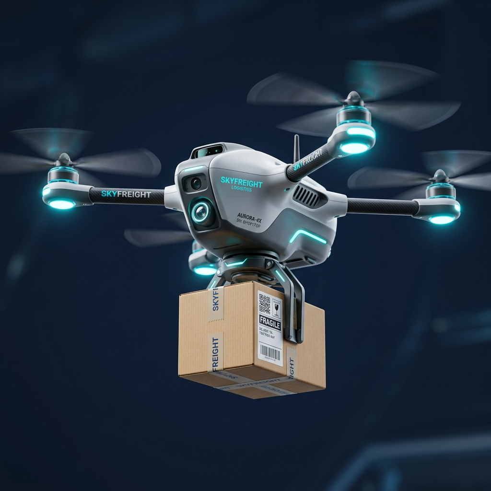

git clone https://github.com/yourusername/drone-autopilot-delivery.git
🚁 Drone AutoPilot Delivery

A Streamlit-based project that separates the frontend UI from the backend delivery logic cleanly.

## Overview

Drone AutoPilot Delivery simulates an autonomous drone package delivery workflow. The project uses a FIFO queue implementation for package management, while Streamlit pages provide the user interface.

## Features
• Real-time dashboard showing queue and drone status
• Add packages into a delivery queue
• Track active deliveries and delivery history
• Clean separation between UI and backend logic

## Visual Preview

Berikut adalah ilustrasi tampilan menu dan antarmuka aplikasi.



> Gambar di atas menampilkan gaya visual aplikasi yang mengarah ke desain dashboard dan interaksi pengiriman paket.

## Project Structure

The project is organized so that only Streamlit frontend files depend on Streamlit, and backend modules stay UI-free.

```
ProjekStrukturData/
├─ app.py                     # Streamlit bootstrap
├─ backend/                   # Backend logic (no Streamlit)
│  ├─ __init__.py
│  ├─ logic.py
│  ├─ package_service.py
│  └─ drone_service.py
├─ pages/                     # Streamlit pages
│  ├─ __init__.py
│  ├─ 1_Dashboard.py
│  ├─ 2_Tambah_Paket.py
│  ├─ 3_Antrean_Drone.py
│  └─ 4_Riwayat.py
├─ assets/
├─ styles/
├─ requirements.txt
├─ test_backend.py
└─ README.md
```

## Running the app (Windows PowerShell)

1. Create and activate a virtual environment:

```powershell
python -m venv venv
venv\Scripts\activate
```

2. Install dependencies:

```powershell
pip install -r requirements.txt
```

3. Run the application:

```powershell
streamlit run app.py
```

Then open `http://localhost:8501` in your browser.

## Frontend / Backend separation

- Frontend: `app.py` and files under `pages/`
- Backend: files under `backend/`

Backend files do not import Streamlit. They only handle queue operations, package creation, and delivery state changes.

## Backend API

- `backend.logic.Queue`
     - `enqueue(data)`
     - `dequeue()` -> dict | None
     - `get_all()` -> list[dict]
     - `remove_at(index)` -> dict | None
- `backend.package_service.add_package(queue, penerima, paket, tujuan, priority, berat)`
- `backend.package_service.get_queue_list(queue)`
- `backend.drone_service.dispatch_next(queue, drones, active_deliveries)`
- `backend.drone_service.mark_package_delivered_by_index(queue, index, history)`
- `backend.drone_service.process_active_deliveries(drones, active_deliveries, history, now=None, threshold_seconds=2)`

## Quick backend test

Run the sample helper script:

```powershell
python test_backend.py
```

## Notes

- `requirements.txt` contains the minimal dependency for the frontend.
- UI logic stays in Streamlit page files; backend logic stays in `backend/`.

## Cara Menjalankan (Windows PowerShell)

1) Buat environment dan aktifkan (direkomendasikan):

```powershell
python -m venv venv
venv\Scripts\activate
```

2) Install dependensi minimal:

```powershell
pip install streamlit
```

3) Jalankan aplikasi:

```powershell
streamlit run app.py
```

Kemudian buka `http://localhost:8501` di browser.

Catatan: gTTS dan audio telah dihapus dari UI utama dalam refaktor ini — jika Anda ingin mengembalikan audio, tambahkan `gtts` di dependencies.

---

## Pemisahan Frontend / Backend — Panduan singkat

- Frontend (Streamlit):
     - File di `pages/` dan `app.py`.
     - Tugas: menampilkan UI, membaca/menulis `st.session_state`, memanggil fungsi di `backend/`.

- Backend (tanpa UI):
     - File di `backend/` seperti `package_service.py`, `drone_service.py`, dan `logic.py`.
     - Tugas: operasi data murni (enqueue, dequeue, dispatch, mark delivered, process deliveries).
     - Jangan import `streamlit` di modul `backend/`.

Contoh panggilan dari frontend (Streamlit page):

```py
from backend.package_service import add_package
from backend.drone_service import mark_package_delivered_by_index, process_active_deliveries

# menambahkan paket ke antrean
add_package(st.session_state.queue, 'Budi', 'Laptop', 'Surabaya', 'Express', 2.5)

# tandai paket index ke-0 sebagai terkirim
mark_package_delivered_by_index(st.session_state.queue, 0, st.session_state.history)

# proses active deliveries (selesai -> masuk history)
process_active_deliveries(st.session_state.drones, st.session_state.active_deliveries, st.session_state.history)
```

---

## API Backend (singkat)

- `backend.logic.Queue`
     - `enqueue(data)`
     - `dequeue()` -> dict | None
     - `get_all()` -> list[dict]
     - `remove_at(index)` -> dict | None

- `backend.package_service`
     - `add_package(queue, penerima, paket, tujuan, priority, berat)` -> dict
     - `get_queue_list(queue)` -> list

- `backend.drone_service`
     - `dispatch_next(queue, drones, active_deliveries)` -> (bool, message)
     - `mark_package_delivered_by_index(queue, index, history)` -> dict | None
     - `process_active_deliveries(drones, active_deliveries, history, now=None, threshold_seconds=2)` -> int

Backend functions are pure Python and simple to unit-test.

---

## Testing backend quickly (example)

Create a short script `test_backend.py` in project root:

```py
from backend.logic import Queue
from backend.package_service import add_package
from backend.drone_service import mark_package_delivered_by_index

q = Queue()
add_package(q, 'A', 'ItemA', 'Kesambi', 'Regular', 1.0)
add_package(q, 'B', 'ItemB', 'Kejaksan', 'Express', 0.5)

removed = mark_package_delivered_by_index(q, 0, [])
print('removed:', removed)
```

Run it with:

```powershell
python test_backend.py
```

---


